# 🛡️ PakCyberGuard – Cybercrime Reporting & Awareness Portal

**PakCyberGuard** is an AI-powered cybercrime reporting and awareness platform developed as a **6th Semester Web Engineering Project** under the **Department of Software Engineering**.

The main purpose of this project is to help Pakistani citizens report cybercrime incidents, learn about online safety, and get quick guidance through an AI chatbot. The frontend of this project was developed by **Qudsia Omama**.

---

## 🔗 Project Overview

PakCyberGuard is designed to provide a secure and user-friendly digital platform where users can:

- Report cybercrime incidents online
- Access awareness content about digital safety
- Learn about warning signs of cyber threats
- Interact with an AI chatbot for basic cybercrime guidance
- Contact support or related organizations
- Understand how to protect themselves from scams, harassment, phishing, and online fraud

> Localhost Development URL: `http://localhost:5173`

---

## 🎯 Objective

The objective of PakCyberGuard is to make cybercrime reporting easier, faster, and more accessible for users, especially those who may not know how to file a complaint or where to seek help.

The platform focuses on:

- Digital safety awareness
- Cybercrime reporting
- User-friendly interface
- Multi-step crime report form
- AI chatbot support
- Awareness and prevention guidance
- Clean and responsive frontend design

---

## ✨ Features

- 🏠 **Homepage** with project introduction and call-to-action sections
- 🔐 **Login Page** for user authentication
- 📝 **Multi-Step Crime Report Form** for structured complaint submission
- 🤖 **AI Chatbot** for cybercrime-related guidance
- 📚 **Awareness Page** with educational cyber safety content
- ⚠️ **Warning Signs Section** to help users identify cyber threats
- 💡 **Security Tips** for safe online behavior
- 👥 **About Us Page** explaining the purpose of the platform
- 📞 **Contact Us Page** for user support
- 📱 **Responsive Design** for better usability across devices

---

## 📸 Screenshots

### 🏠 Homepage

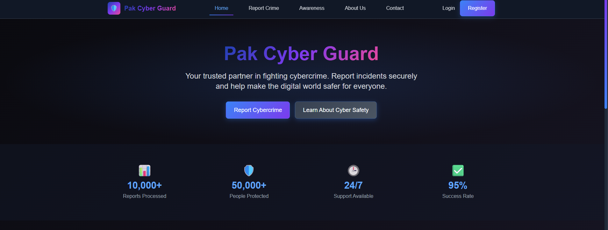

 

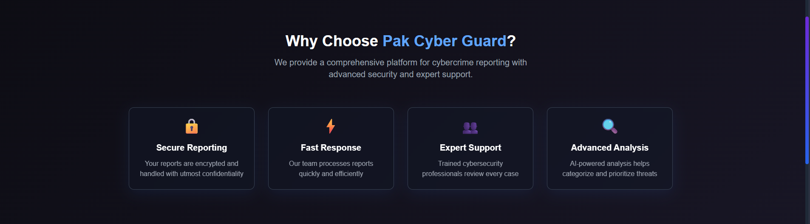

---

### 🔐 Login Page

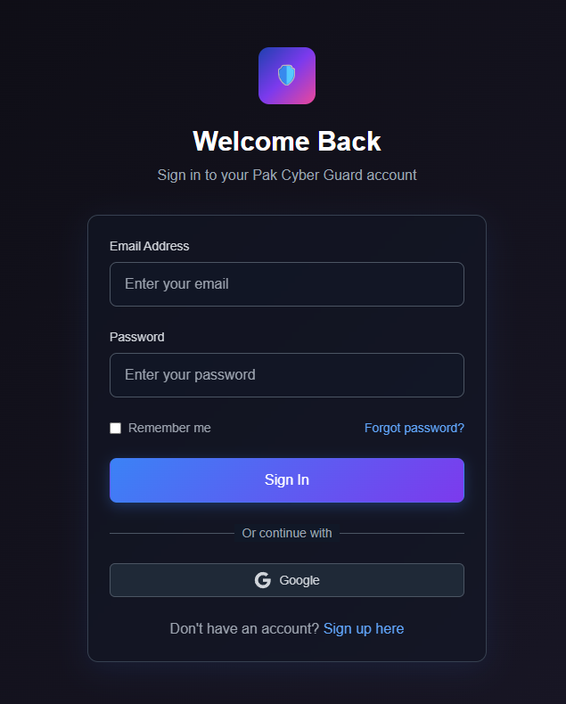

---

### 📝 Report Crime Form

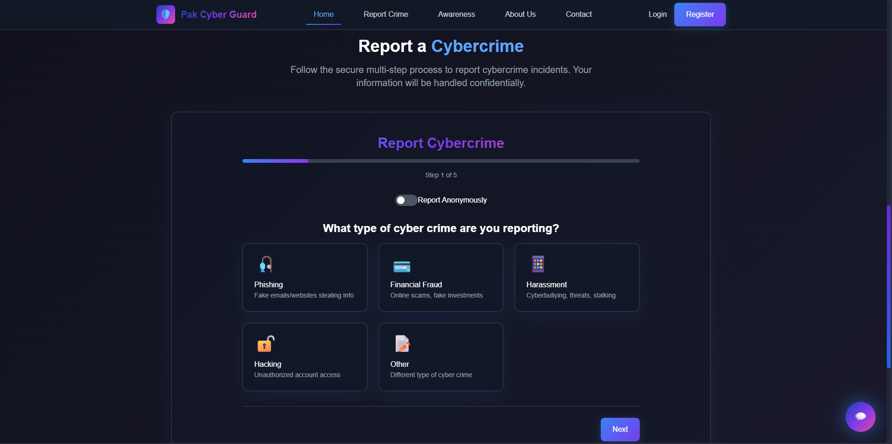

 

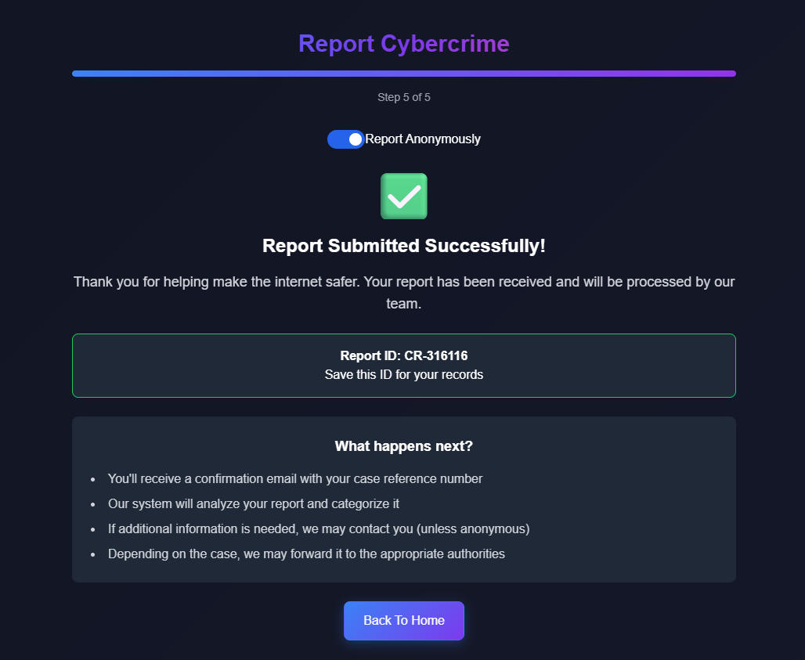

 

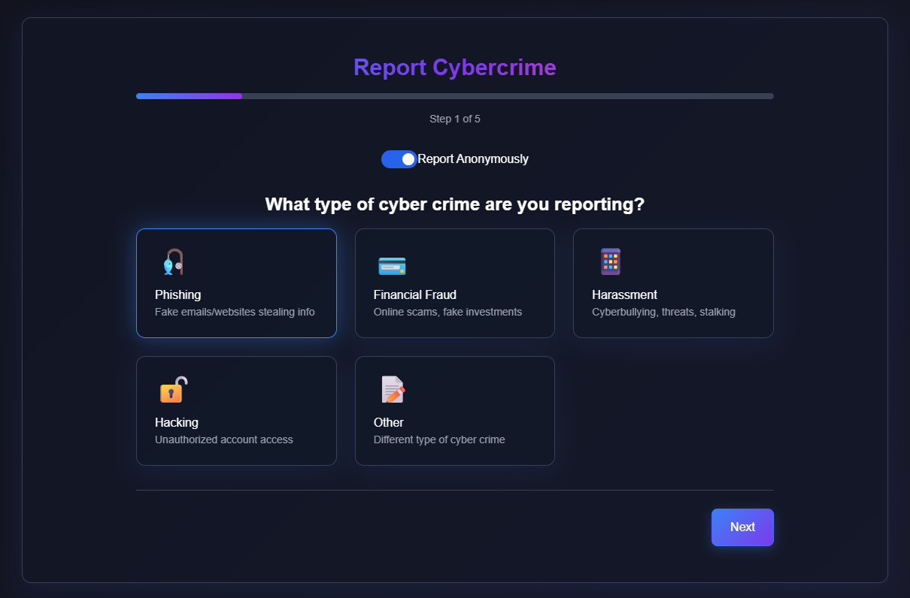

 

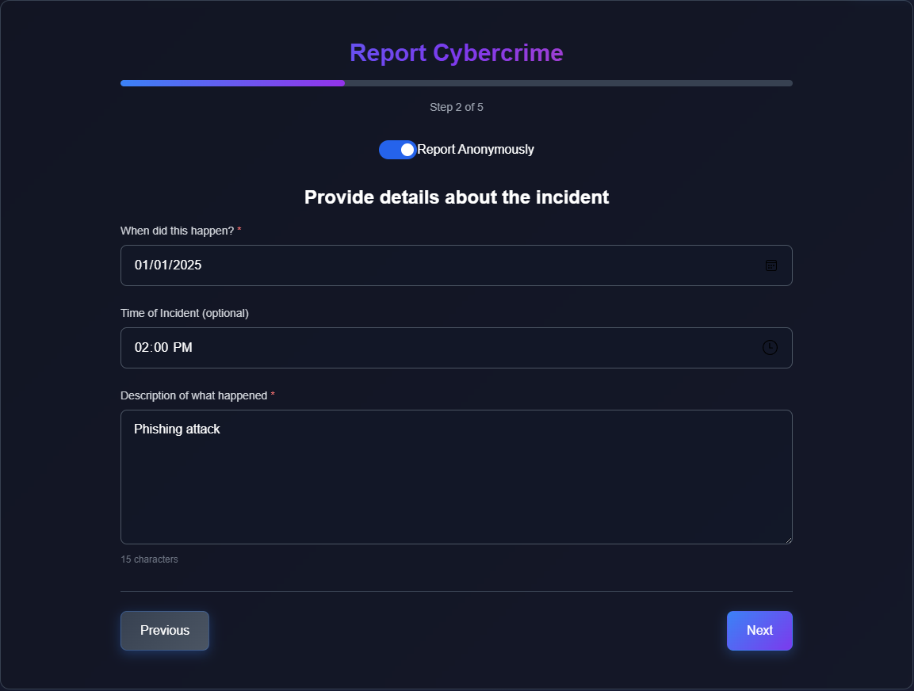

 

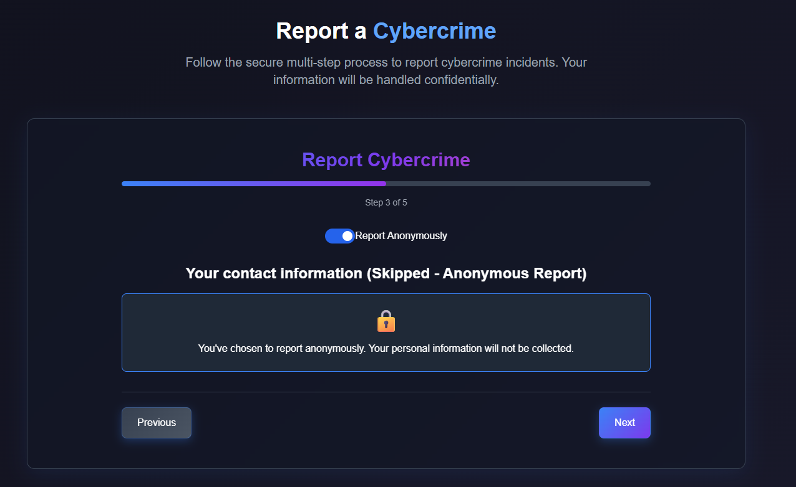

 

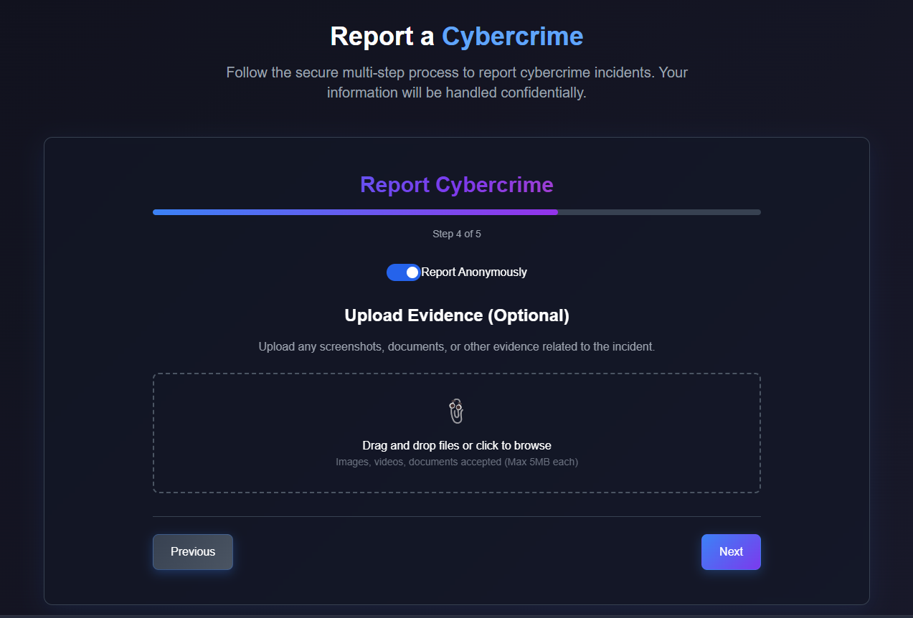

 

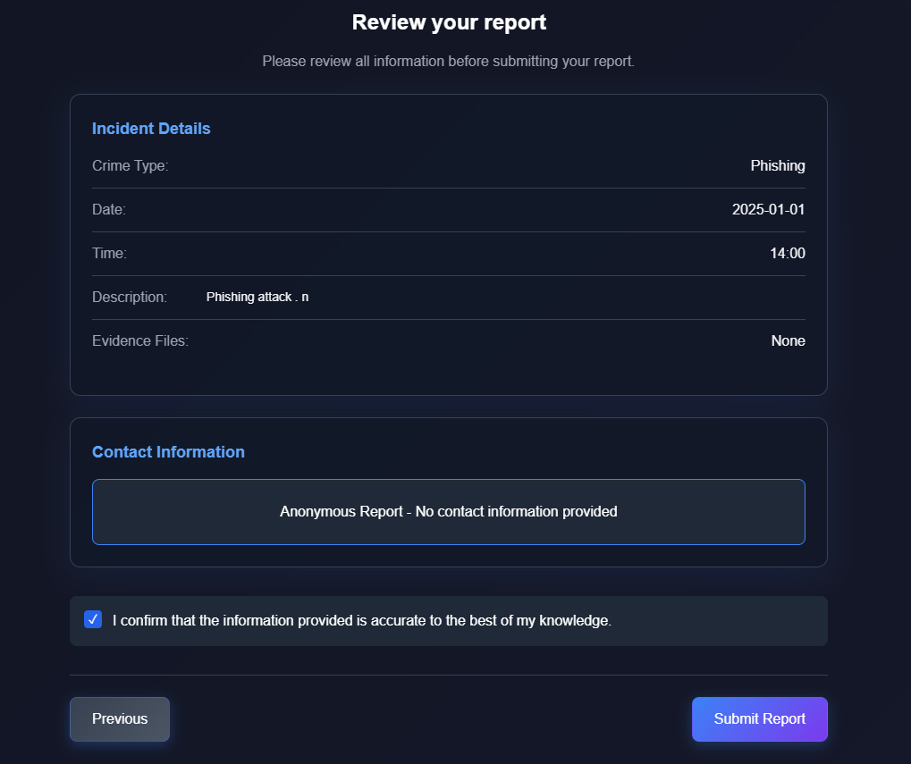

---

### 🤖 AI Chatbot

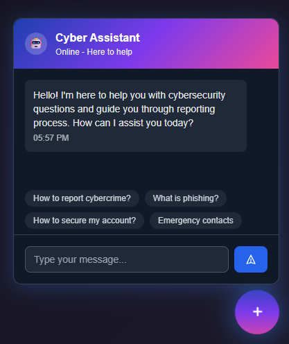

---

### 📚 Awareness Page

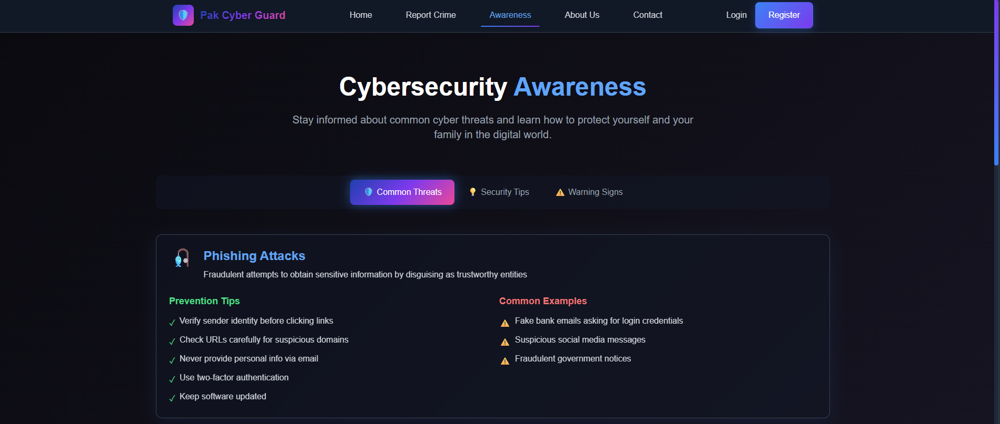

 

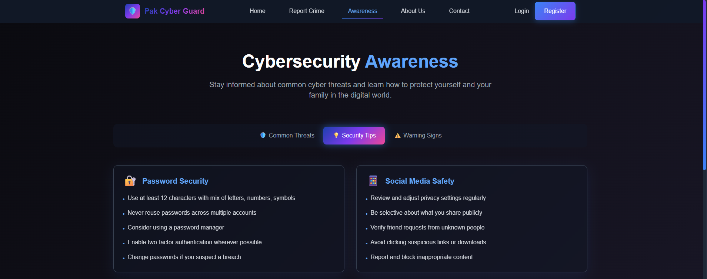

 

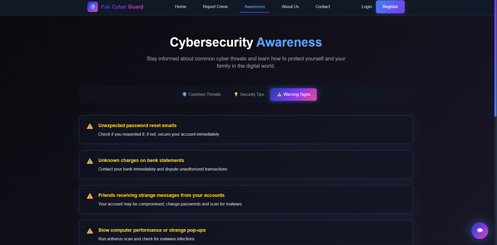

---

### 👥 About Us Page

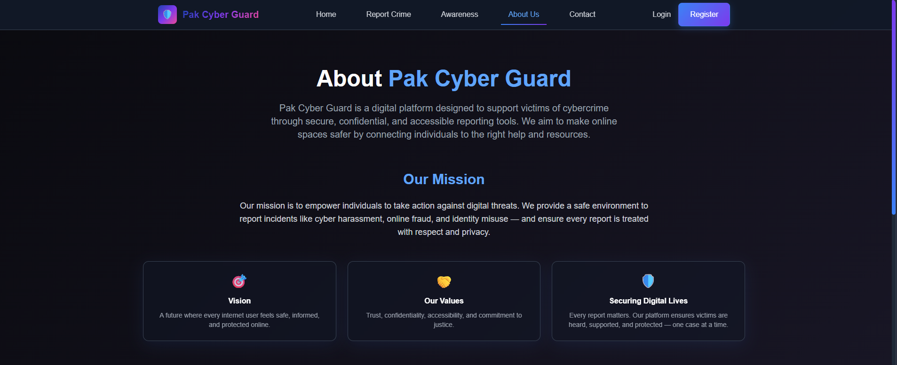

---

### 📞 Contact Us Page

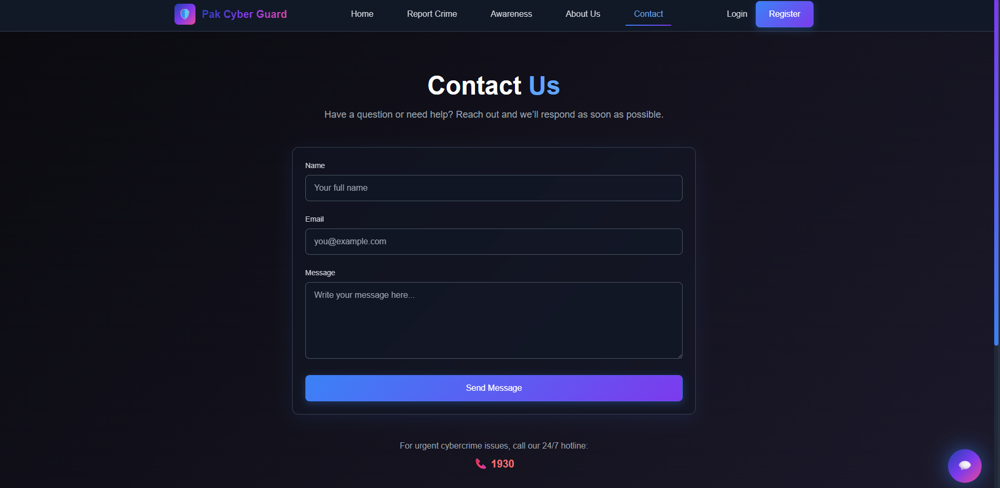

---

## 🧰 Technology Stack

### Frontend

- **ReactJS**
- **JavaScript**
- **Tailwind CSS**
- **HTML**
- **CSS**
---

## 👩‍💻 Frontend Developed By

| Name | Role | Semester |
|---|---|---|
| Qudsia Omama | Frontend Developer | 6th Semester |

---

